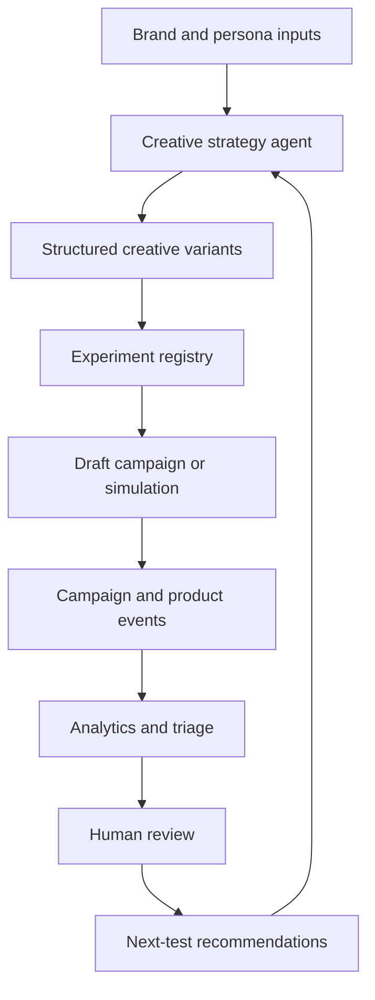

# AI-Powered Creative Optimization & Growth Operations Agent

An end-to-end portfolio project demonstrating how a consumer B2C growth team can use AI, experimentation, analytics, and marketing APIs to improve paid acquisition and creative operations.

The system generates structured creative concepts, prepares draft campaigns, analyzes simulated or authorized performance data, recommends actions, and converts findings into the next round of testable hypotheses.

> **Portfolio disclosure:** This is an independently built portfolio simulation. It demonstrates how a high-spend consumer growth team could structure creative generation, campaign operations, experimentation, and performance analysis. It must not be presented as evidence of managing a real $100K+/month ad budget unless supported by verifiable professional experience.

## Why This Project Exists

High-growth consumer companies need marketers who can connect:

- Creative strategy and production
- Paid acquisition across multiple channels
- Experiment design and measurement
- CAC, LTV, activation, and retention
- AI-assisted workflows and operational automation

This project demonstrates those capabilities through a working, explainable, and safety-conscious system—not merely an AI copy generator.

## Default Use Case

The default case study is a mobile-first gaming technology company with an AI-powered platform where users create, share, and discover games.

Example audiences:

- Casual mobile players
- Aspiring game creators
- UGC creators and streamers
- Social gamers
- AI-curious creative users

Students may adapt the project to another consumer B2C product while preserving the acquisition-to-retention framework.

## Learning Objectives

By completing this project, a student should be able to:

1. Develop a multi-channel paid acquisition strategy.
2. Translate customer research into personas, hooks, messages, and creative briefs.
3. Design controlled creative experiments with explicit hypotheses.
4. Analyze CAC, CPC, CTR, CVR, ROAS, activation, retention, and LTV.
5. Connect acquisition data to downstream product behavior.
6. Generate and validate structured LLM outputs.
7. Design safe, human-approved marketing automation.
8. Communicate findings through dashboards, weekly reviews, and a case study.

## Project Status

Keep this table accurate. Never describe planned or simulated functionality as production-ready.

| Capability          | MVP                            | Advanced version              |
| ------------------- | ------------------------------ | ----------------------------- |
| Creative generation | Anthropic API or mock provider | Evaluated multi-step workflow |
| Campaign creation   | Local mock connector           | Authorized platform drafts    |
| Performance data    | Synthetic dataset              | Authorized reporting data     |
| Performance triage  | Recommendation only            | Human-approved action         |
| Auto-pause          | Disabled                       | Optional, guarded, audited    |
| Product events      | Simulated first-party events   | Authorized analytics source   |
| Retention and LTV   | Cohort simulation              | Observed first-party outcomes |
| Feedback loop       | Offline portfolio workflow     | Scheduled monitored workflow  |

## Workflow



The default workflow is `dry-run` and `recommend-only`. The system must not spend money, publish an ad, modify a budget, or pause a live campaign without explicit authorization and an audit trail.

## Scope

### Included

- Persona and messaging configuration
- AI-assisted briefs, hooks, copy, scripts, and visual concepts
- Experiment registration and variant tracking
- Campaign naming and UTM generation
- Synthetic campaign and product-event data
- Performance, cohort, retention, and LTV analysis
- Creative-performance diagnostics
- Human-reviewed scale, hold, revise, and pause recommendations
- Optional draft-only Meta and TikTok connectors
- Weekly growth review and portfolio case study

### Non-goals

- Claiming simulated results as real outcomes
- Unsupervised production budget changes
- Circumventing platform policy or review
- Treating platform attribution as ground truth
- Replacing legal, privacy, brand, or compliance review
- Applying one KPI threshold to every campaign

## Architecture

| Layer           | Responsibility                                            |
| --------------- | --------------------------------------------------------- |
| Strategy        | Brand, audience, funnel, messaging, and hypotheses        |
| Generation      | Structured briefs and creative variants                   |
| Experimentation | Controls, variables, evidence rules, and decisions        |
| Connectors      | Mock or authorized marketing and product data             |
| Analytics       | Campaign, cohort, retention, LTV, and creative analysis   |
| Decisioning     | Explainable recommendations with confidence and rationale |
| Governance      | Approvals, audit logs, secrets, policy, and cost controls |
| Reporting       | Dashboards, weekly reviews, and portfolio outputs         |

## Creative Intelligence Schema

Each creative must preserve the strategy behind it—not just the final copy.

```yaml
creative_id: cr_001
persona: aspiring_game_creator
awareness_stage: problem_aware
customer_pain: game_development_feels_inaccessible
value_proposition: create_without_traditional_coding
angle: speed_to_first_creation
hook_type: demonstration
primary_hook: "What if your game idea became playable today?"
supporting_claim: null
proof_type: product_demo
visual_concept: prompt_to_game_transformation
opening_3_seconds: show_prompt_then_gameplay
script: "..."
headline: "Turn an idea into a game"
primary_text: "..."
cta: start_creating
landing_page_message: create_your_first_game
hypothesis: demonstration_hooks_increase_qualified_signups
variable_tested: hook
control_id: cr_000
compliance_notes: avoid_unsubstantiated_speed_claims
```

Outputs may support static ads, short-form video scripts, UGC concepts, landing-page message matching, lifecycle email, and organic-to-paid candidates.

## Experimentation Framework

Generating many ads is not the same as running an experiment. Each test should isolate one meaningful variable whenever practical.

Every experiment must define:

- Business question and hypothesis
- Control and variants
- Variable tested
- Audience and channel
- Primary and guardrail metrics
- Minimum evidence requirement
- Evaluation window
- Decision rule
- Result, confidence, learning, and next action

```yaml
experiment_id: exp_001
question: Which hook attracts users more likely to create a game?
hypothesis: Product-demo hooks improve activated-user CAC.
channel: meta
variable_tested: hook_type
control: cr_000
variants: [cr_001, cr_002]
primary_metric: activated_user_cac
guardrail_metrics: [ctr, signup_cvr, day_7_retention]
minimum_clicks_per_variant: 300
evaluation_window_days: 7
decision_rule: recommend_only
```

## Measurement Framework

### Acquisition

- Spend, impressions, reach, and CPM
- Clicks, CTR, and CPC
- Landing-page views and signups
- CVR, CAC, and ROAS

### Activation

- Account created
- First game started, completed, published, and shared
- Activated-user rate and activated-user CAC

### Retention and Revenue

- Day 1, Day 7, and Day 30 retention
- Returning creator rate
- Games per retained user
- Subscription starts and cohort revenue
- LTV, LTV:CAC, and payback period

### Creative Intelligence

- Performance by hook, angle, format, persona, and CTA
- Creative fatigue
- Video hold rate when available
- CTR-to-activation relationship
- Creative-level retention and LTV
- High-click, low-quality acquisition patterns

### Operational Efficiency

- Time from brief to approval
- Variants generated and approved
- Schema validation failure rate
- Cost per approved concept
- Recommendation acceptance rate
- Failed or duplicate API operations

## Data Model

The synthetic dataset must include advertising and first-party product events.

Recommended events:

- `ad_click`
- `landing_page_view`
- `user_signup`
- `game_started`
- `game_created`
- `game_published`
- `game_shared`
- `session_returned`
- `subscription_started`
- `revenue_generated`

Preserve these join keys where applicable:

- `user_id`, `anonymous_id`, `event_timestamp`
- `campaign_id`, `ad_set_id`, `creative_id`, `experiment_id`
- `utm_source`, `utm_medium`, `utm_campaign`, `utm_content`

Document fields, formulas, attribution assumptions, time zones, currencies, null handling, and limitations in `data/data_dictionary.md`.

## Decision and Safety Model

A rule such as `Spend > $50 AND CVR < 1%` is not sufficient for a production decision. Recommendations should consider:

- Campaign objective and optimization event
- Attribution and conversion-delay windows
- Minimum impressions, clicks, and conversions
- Learning phase and exploration budget
- Audience size and saturation
- Baselines and cohort differences
- Statistical uncertainty
- Creative fatigue
- Blended versus platform-reported CAC
- Downstream activation and retention

| State           | Meaning                                      |
| --------------- | -------------------------------------------- |
| Observe         | Insufficient evidence; keep collecting data  |
| Revise          | Preserve the hypothesis but change execution |
| Hold            | Continue without increasing investment       |
| Scale           | Increase cautiously after review             |
| Pause candidate | Recommend pausing with evidence              |
| Approved action | A human authorized the platform change       |

Live mutations must be idempotent, logged, reversible where possible, and protected by explicit approval.

## Repository Structure

```text
├── README.md
├── AGENTS.md
├── PROJECT_BRIEF.md
├── CURRICULUM.md
├── ARCHITECTURE.md
├── CASE_STUDY.md
├── DEMO.md
├── DECISIONS.md
├── config/
│   ├── settings.py
│   ├── brand.yaml
│   ├── personas.yaml
│   ├── experiments.yaml
│   ├── metrics.yaml
│   └── safety_rules.yaml
├── prompts/
│   ├── system_prompt.md
│   ├── creative_strategy.md
│   ├── creative_generation.md
│   ├── performance_diagnosis.md
│   └── winner_iteration.md
├── src/
│   ├── agents/
│   ├── analytics/
│   ├── attribution/
│   ├── connectors/
│   ├── experiments/
│   ├── governance/
│   ├── reporting/
│   └── models/
├── data/
│   ├── raw/
│   ├── processed/
│   ├── synthetic/
│   └── data_dictionary.md
├── dashboards/
├── notebooks/
├── examples/
├── scripts/
│   ├── generate_synthetic_data.py
│   └── run_pipeline.py
├── tests/
│   ├── unit/
│   ├── integration/
│   ├── contract/
│   └── fixtures/
├── .github/workflows/
├── .env.example
├── pyproject.toml
├── Makefile
└── LICENSE
```

## Recommended Build Curriculum

Do not begin with live marketing APIs. Build an end-to-end local system first, then replace mock components selectively.

| Phase | Focus                         | Required evidence                       |
| ----- | ----------------------------- | --------------------------------------- |
| 0     | Business problem and KPI tree | Brief, funnel, metric definitions       |
| 1     | Synthetic data and baseline   | Dataset, SQL/Pandas analysis, report    |
| 2     | Persona and creative strategy | Research, message map, briefs           |
| 3     | Structured AI generation      | Validated outputs and prompt tests      |
| 4     | Experiment registry           | Controls, variants, decision rules      |
| 5     | Performance triage            | Explainable recommendations             |
| 6     | Retention and LTV             | Cohort and acquisition-quality analysis |
| 7     | Platform connectors           | Mock first; draft mode optional         |
| 8     | Agentic workflow              | Review gates, audit and cost controls   |
| 9     | Portfolio packaging           | Dashboard, demo, case study, deck       |

Each phase should have acceptance criteria in `CURRICULUM.md`.

## AI Agent Working Rules

The complete coding-agent instructions belong in `AGENTS.md`. At minimum, the agent must:

- Read the brief, architecture, and relevant module before editing.
- Default to mock data, dry-run, and recommendation-only behavior.
- Never expose credentials or commit `.env`.
- Never publish ads, change budgets, or pause campaigns without approval.
- Never present synthetic outcomes as real results.
- Add or update tests for material behavior changes.
- Validate LLM outputs before downstream use.
- Record significant decisions in `DECISIONS.md`.
- Update documentation when behavior changes.
- Report what was tested, what remains simulated, and known limitations.

## Getting Started

### Prerequisites

- Python 3.11+
- Git
- Optional Anthropic API key
- Marketing-platform credentials only for authorized advanced connectors

The local simulation must run without Meta or TikTok credentials.

### Installation

```bash
git clone https://github.com/your-username/ai-growth-operations-agent.git
cd ai-growth-operations-agent
python -m venv .venv
source .venv/bin/activate
pip install -e ".[dev]"
```

Windows PowerShell:

```powershell
.venv\Scripts\Activate.ps1
pip install -e ".[dev]"
```

### Configuration

```bash
cp .env.example .env
```

```env
APP_ENV=development
DRY_RUN=true
RECOMMEND_ONLY=true
ALLOW_LIVE_MUTATIONS=false

ANTHROPIC_API_KEY=
ANTHROPIC_MODEL=your-supported-model-id

META_ACCESS_TOKEN=
META_AD_ACCOUNT_ID=
TIKTOK_ACCESS_TOKEN=
TIKTOK_ADVERTISER_ID=
```

Do not commit `.env` or real customer data.

### Run the Local Demo

```bash
python scripts/generate_synthetic_data.py
python scripts/run_pipeline.py generate --dry-run
python scripts/run_pipeline.py analyze
python scripts/run_pipeline.py triage --recommend-only
python scripts/run_pipeline.py report --weekly
```

Advanced commands may include:

```bash
python scripts/run_pipeline.py publish --platform meta --draft-only
python scripts/run_pipeline.py approve --action-id ACTION_ID
```

Advanced commands should remain unavailable until safety controls and integration tests pass.

## Testing and Quality Gates

Before a phase is complete, verify:

- Unit tests pass.
- Pydantic validates all structured outputs.
- Mock connector contract tests pass.
- Duplicate operations are prevented.
- Missing and delayed conversion data are handled.
- Formulas match the data dictionary.
- Simulation labels appear in all reports.
- LLM outputs are checked for unsupported claims.
- Logs contain no credentials or personal data.
- README commands match actual behavior.

```bash
pytest
ruff check .
ruff format --check .
mypy src
```

## Required Demo Scenarios

1. **Creative strategy:** Generate three strategically distinct concepts for one persona and objective.
2. **Controlled experiment:** Register a control and variants that isolate one variable.
3. **Acquisition quality:** Show why the highest-CTR creative may not be best after activation and retention.
4. **Weekly growth review:** Produce evidence-based scale, hold, revise, or pause recommendations and define the next tests.

## Portfolio Deliverables

- Working local demo
- Architecture diagram
- Synthetic dataset and data dictionary
- Creative strategy and message map
- Briefs and generated variants
- Experiment registry
- Acquisition and retention dashboard
- Budget-allocation simulation
- Weekly growth review
- Test suite and CI workflow
- Three-to-five-minute demo video
- Interview-ready case study

## Case Study Structure

Use `CASE_STUDY.md` to explain:

1. Business problem
2. Customer and growth hypothesis
3. Measurement strategy
4. Creative and experiment design
5. System architecture
6. Key simulated findings
7. Decision recommendations
8. Limitations and risks
9. What real data would validate
10. Next experiment

Label simulated metrics clearly. The quality of reasoning matters more than manufacturing impressive results.

## Evaluation Rubric

| Area                 | Weight | Strong evidence                                |
| -------------------- | -----: | ---------------------------------------------- |
| Growth strategy      |    15% | Clear funnel, personas, hypotheses, KPI tree   |
| Creative strategy    |    20% | Distinct concepts and actionable briefs        |
| Analytics            |    20% | Correct metrics, cohorts, retention, LTV       |
| Experimentation      |    15% | Sound controls and decision criteria           |
| AI system design     |    10% | Validation, evaluation, retries, cost controls |
| Engineering quality  |    10% | Modular code, tests, CI, documentation         |
| Safety and integrity |    10% | Approval gates, audit, honest labeling         |

## Operational Considerations

A production-oriented extension should address:

- Rate limits and exponential backoff
- Credential rotation and token expiration
- Idempotency and duplicate prevention
- Partial failures and retry policy
- Structured logs and audit history
- Model and API version changes
- LLM cost limits
- Data privacy and retention
- Attribution uncertainty
- Rollback and incident response
- Advertising-platform policies

## Limitations

- Synthetic behavior cannot prove real market response.
- Platform-reported conversions may be incomplete or biased.
- Retention and LTV require first-party data and sufficient time.
- Small samples produce unstable creative rankings.
- LLMs can generate plausible but unsupported claims.
- APIs, permissions, schemas, and models change over time.
- Recommendations still require business context and human judgment.

## Responsible Portfolio Presentation

Recommended wording:

> I built a portfolio simulation of an AI-assisted growth operations system for a mobile-first consumer product. It connects creative experiments and paid acquisition metrics to activation, retention, and LTV, with human approval required for campaign actions.

Do not claim autonomous management of a $100K/month account unless supported by genuine, verifiable experience.

## Roadmap

- [ ] Define the business brief, funnel, and KPI tree
- [ ] Build synthetic acquisition and product-event data
- [ ] Implement validated creative briefs and variants
- [ ] Add experiment tracking and UTM governance
- [ ] Build acquisition, retention, and LTV analysis
- [ ] Add explainable triage recommendations
- [ ] Create a Creative Intelligence Dashboard
- [ ] Create a budget-allocation simulator
- [ ] Add mock connector contract tests
- [ ] Add optional authorized draft-mode connectors
- [ ] Publish the case study and demo video

## License

MIT License. See `LICENSE` for details.
